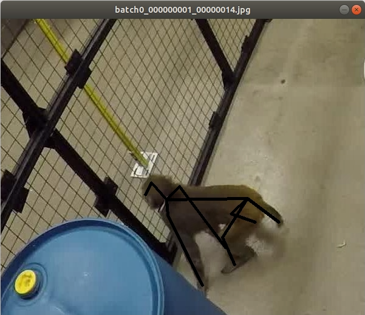
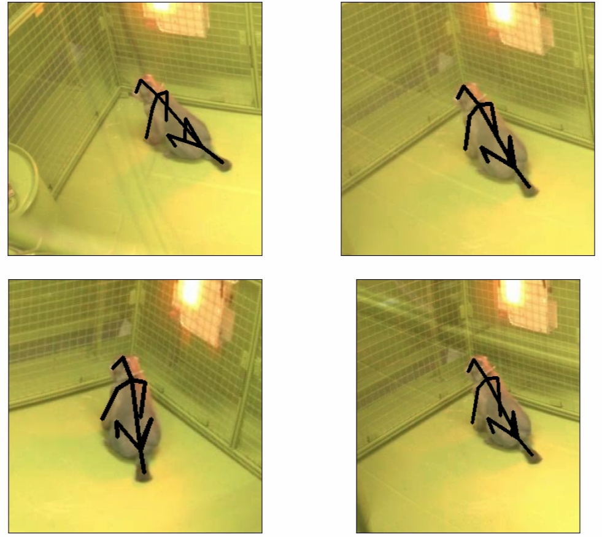

OpenMonkeyStudio Model and Dataset
=============================================

## Introduction
The OpenMonkeyStudio repository is a work in progress and will be updated on a regular basis. 2D and 3D label data along with the images used for training are available at https://z.umn.edu/OMSdata

## Data folder contents and structure
The structure of the zip file is as follows:
```sh
+-- Batch7
|   +-- camera.txt
|   +-- coords_3D.mat
|   +-- crop_para.mat
|   +-- intrinsic.txt
+-- Batch9
+-- Batch9a
+-- Batch9b
+-- Batch10 
+-- Batch11
+-- Data.mat
+-- image_label_visualizer.py
+-- Images
|   +-- batch0_000000001_00000002.jpg
|   +-- batch0_000000001_00000004.jpg
|   +-- .
+-- Readme.pdf
+-- reprojection.py

```
The contents of the zip file are explained below:
1. Images are stored in the `Images` folder. The images have the following format: `batch(batch#)_(frame#)_(cameraID).jpg`, Eg. `batch7_000003120_18064162.jpg`
		
2. 2D annotations are stored in `Data.mat` file\
The file comprises of image filenames and image information. It also comprises of labels for 13 2D joints of the subject in the image.\
`T.name` (194518x1): Image filenames\
`T.data` (194518x30): Labels for the 2D pose in respective images. The data is stored in the following format: \
	`Top-Left point` `Image_shape` `nose position` `head position` `neck position` `R.Shoulder position` `R.Hand position` `L.Shoulder position` `L.Hand position` `Hip position` `R.Knee position` `R.Foot position` `L.Knee position` `L.Foot position` `Tail`\
Example: `0 0 Image_height Image_width y1 x1 y2 x2 ... y13 x13`

3. 3D information has been uploaded for the following batches: `7, 9, 9a, 9b, 10, 11`. The folder for each batch comprises of the extrinsics and intrinsics of the cameras used during the capture of the respective batch. The folder also comprises of cropping parameters for the images in each batch, along with the 3D information for each frame.\
The files available in each folder have the following format:\
### File formats
1. `camera.txt:` The file comprises of the rotation matrices and camera centers for each camera in the batch
```sh
NumCams 62
NumFrames 62
NumP 62
0 camID
C (1x3) … Camera center
R (3x3) … Rotation matrix
.
.
```
Example:
```sh
NumCams 62
NumFrames 62
NumP 62
0 18064162 
7.566247e-01 -3.652013e-02 -3.071504e+00 
9.962194e-01 -7.379663e-02 -4.583673e-02 
6.721757e-02 9.890431e-01 -1.314361e-01 
5.503405e-02 1.278582e-01 9.902644e-01 
0 18260132 
1.887207e+00 -7.456747e-02 -3.053667e+00 
9.922224e-01 -4.990314e-02 1.140367e-01 
6.738378e-02 9.856155e-01 -1.549887e-01 
-1.046620e-01 1.614675e-01 9.813125e-01 
.
.
```
2. `intrinsic.txt:` The file comprises of the intrinsic matrices and distortion parameters for each camera. The model used for calibration is `RADIAL`
```sh
0 camID
K (3x3) … Intrinsic parameters
D (1x2) … Distortion parameters
.
.
```
Example:
```sh
0 18064162 
7.873470e+02 0 640 
0 7.873470e+02 512 
0 0 1 
-3.531380e-01 1.173270e-01 
0 18260132 
7.932990e+02 0 640 
0 7.932990e+02 512 
0 0 1 
-3.480520e-01 1.167730e-01 
.
.
```
3. 3D annotations are stored in `coords_3D.mat` file:\
The file comprises of 3D information for 13 joints of the subject in the particular frame\
`coords` (nx4): First column gives information about the frame number. The next 3 columns provide information about the X, Y and Z coordinates (`n = 13xn’` where `n’` is the  no. of frames)
 - Each row comprises of 3D information for each joint of each frame
 - The format of each row is as follows: `Frame#` `X` `Y` `Z`, Eg. `3120` `3.6364` `0.2717` `1.8471`
 - The order for the joints is as follows: `Nose-Head-Neck-RShoulder-RHand-LShoulder-LHand-Hip-RKnee-RFoot-LKnee-LFoot-Hip`

4. The cropping parameters are stored in `crop_para.mat` file:\
The file comprises of cropping parameters for the images (that have 3D information available)\
`crop` (nx6): The array stores information for frame#, cameraID, top-left position of the cropped image in the original image (x, y) and image size (Image_width Image_Height)
 - The format of each row is as follows: `Frame#` `cameraID` `x` `y` `w` `h`, Eg. `3120` `18064162` `789` `327` `381` `382`

### image_label_visualizer.py
This code helps to visualize the 2D labels for images
```sh
python3 image_label_visualizer.py -i 10
```
The above command will show the visualization for the 10th image (default is 0th image)\


### reprojection.py
This code helps to visualize the 2D reprojections of the 3D coordinates for any chosen frame
```sh
python3 reprojection.py -b 7 -f 10
```
The above command will show the visualization for the 10th frame in batch 7 (default is batch 7 frame 0)\

